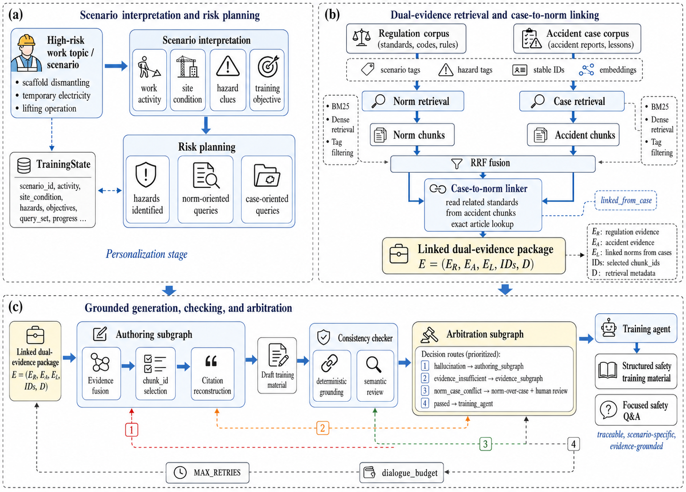

# 3. Methodology

## 3.1. Overall framework of scenario-personalized dual-evidence safety training

This study formulates pre-task construction safety training as a scenario-personalized and evidence-grounded generation task. Given a high-risk construction work topic, the proposed method first interprets the corresponding work scenario and risk context, then retrieves two complementary types of evidence, namely regulatory requirements and accident cases, and finally generates structured safety training material whose key claims are traceable to retrieved evidence. The method is designed for safety briefings, toolbox training, and focused safety question answering, where the generated content must be operationally relevant, technically reliable, and auditable.

The personalization unit in this study is the high-risk work scenario rather than an individual worker profile. Existing personalized safety training systems often depend on worker attributes, job roles, violation records, equipment usage, location information, or mobile-device context. Although such information can support fine-grained personalization, it may be difficult to obtain in research settings and may introduce privacy, deployment, and data-governance constraints. In contrast, this study organizes personalization around the work activity, hazard type, accident mechanism, and training objective. For example, scaffold dismantling, temporary electrical work, lifting operations, and work at height are treated as distinct training scenarios. Each scenario determines the hazards to be covered, the regulatory clauses to be retrieved, and the accident mechanisms to be explained. This design preserves the operational specificity required for construction safety training while avoiding dependence on personal worker data.

The framework uses two complementary evidence types. Regulation evidence provides authoritative safety requirements, including mandatory protective measures, prohibited actions, inspection items, and procedural constraints. Accident-case evidence provides experiential and cautionary support, including how accidents occurred, which unsafe acts or conditions contributed to them, and what consequences followed. These two evidence types answer different training questions. Regulations clarify what must be done, whereas accident cases explain why the requirement matters in practice. Training material based only on regulations may be accurate but abstract, while material based only on accident cases may be vivid but insufficiently authoritative. Therefore, the proposed method treats regulation evidence and accident-case evidence as a joint evidence substrate for generating safety training content.

The workflow is implemented as a LangGraph-based Agentic RAG system rather than a linear retrieve-then-generate prompt chain. Specifically, the training workflow is compiled as a `StateGraph` over a shared `TrainingState`. Each agent, node, or subgraph reads selected state fields, writes structured outputs back into the same state, and transfers control through explicit graph edges. This design makes the agentic process reproducible and inspectable. The system does not rely on several independent chat agents negotiating through unconstrained natural language. Instead, it relies on typed state updates, evidence identifiers, conditional routes, and bounded loops that can be logged, checked, and evaluated.

At the graph level, the method contains three coordinated subgraphs. The evidence acquisition subgraph receives the interpreted scenario, plans hazards, rewrites queries, retrieves regulation and accident evidence through separate paths, and resolves case-to-norm links. The authoring subgraph fuses the retrieved evidence, selects valid `chunk_id` citations, reconstructs citation content from retrieved chunks, and drafts structured training material. The arbitration subgraph reviews checker outputs and decides whether the workflow should return to evidence acquisition, return to authoring, apply a norm-over-case policy, or release the output. The top-level route is therefore:

```text
scenario_agent -> evidence_subgraph -> authoring_subgraph
-> arbitration_subgraph -> training_agent
```

Conditional routes are triggered when the checker identifies hallucinated citations, evidence insufficiency, or norm-case conflict. Only hallucination and evidence insufficiency form bounded loops; norm-case conflict is handled through the norm-over-case policy and a human-review flag.

Figure 1 summarizes the overall workflow in three stages. Figure 1a shows how a high-risk work topic is converted into a scenario-specific training state through scenario interpretation and risk planning. Figure 1b shows how regulation evidence and accident-case evidence are retrieved through separate paths and connected through case-to-norm linking. Figure 1c shows how the linked evidence package is converted into structured training material through grounded authoring, consistency checking, and bounded arbitration.



**Figure 1. Overall workflow of the proposed scenario-personalized dual-evidence Agentic RAG method.** (a) A high-risk work topic is converted into a scenario-specific training state through scenario interpretation and risk planning. (b) Regulation and accident-case evidence are retrieved through separate paths and linked through case-to-norm lookup. (c) The linked evidence package is converted into structured training material through grounded authoring, consistency checking, and bounded arbitration.

The remainder of this section follows the framework structure. Section 3.2 describes how the scenario-oriented dual-evidence knowledge base is constructed. Section 3.3 presents the case-to-norm linking mechanism and the dual-path retrieval process. Section 3.4 explains how the linked evidence package is converted into grounded training material and controlled through consistency checking and arbitration.

## 3.2. Scenario-oriented dual-evidence knowledge base

The evidence base is designed as a task-oriented repository rather than a general construction document store. In a generic RAG system, source documents are often divided into fixed-size chunks and retrieved mainly by text similarity. This strategy is insufficient for construction safety training for three reasons. First, regulatory requirements must be cited at the article level because compliance-related claims are normally asserted against specific clauses. Second, accident warnings must remain traceable to source cases because unsupported or exaggerated accident descriptions can reduce credibility and may mislead trainees. Third, the relevance of a regulation or accident case depends not only on semantic similarity, but also on the work scenario, hazard mechanism, and training purpose. The proposed evidence base therefore combines stable identifiers, source metadata, scenario tags, hazard tags, and vector representations.

Regulation evidence is segmented at the level of regulatory articles whenever the source structure allows article-level parsing. Tables, figures, definitions, and explanatory notes are retained as separate chunks when they contain safety-relevant information or support the interpretation of article-level requirements. Each norm chunk is represented as:

```text
c_i^R = (chunk_id, standard_code, article_id, text, metadata,
         scenario_tags, hazard_tags, requirement_type, embedding).
```

The `chunk_id` is a stable provenance anchor constructed from the standard code and article identifier, such as `JGJ-80-2016:3.0.5`. The `standard_code` and `article_id` fields support exact citation and exact lookup. The `text` field stores the regulatory content. The `metadata` field retains the standard name, chapter, title, source path, and chunk type. The `scenario_tags` field records relevant work scenarios, such as work at height, temporary electricity, scaffold use, scaffold dismantling, lifting operations, and construction machinery. The `hazard_tags` field records risk types, such as fall from height, electric shock, object strike, collapse, mechanical injury, lifting injury, and management deficiency. The `requirement_type` field distinguishes mandatory requirements, prohibited behaviors, inspection requirements, protective measures, definitions, tables, and other regulatory functions.

Accident evidence is structured around accident events and their causal descriptions. The raw accident report is not treated as a single undifferentiated text block. Instead, each case is parsed into chunks that preserve the accident process, causal factors, consequences, and available regulatory references. Each case chunk is represented as:

```text
c_j^A = (chunk_id, case_id, accident_type, process, causes,
         consequences, related_standards, metadata,
         scenario_tags, hazard_tags, embedding).
```

The `case_id` identifies the accident case across chunks. The `accident_type` field records the primary accident category, such as fall from height, object strike, electric shock, collapse, mechanical injury, or lifting injury. The `process` field describes how the accident unfolded. The `causes` field records direct and indirect causes, including unsafe acts, missing protections, equipment defects, management failures, and environmental conditions. The `consequences` field records casualties, losses, or reported outcomes. The `related_standards` field stores article-level references to regulations when such references are available in the original report or can be verified during data preparation. These references are normalized into a `standard_code:article_id` form whenever possible.

The two evidence types play different methodological roles. Norm chunks provide the authoritative basis for safety requirements, while accident chunks provide causal warnings and consequence explanations. This separation prevents accident-derived experience from being treated as a substitute for formal regulation. At the same time, it prevents regulatory clauses from being presented as abstract rules without practical accident context. Shared scenario and hazard metadata make it possible to retrieve both types of evidence for the same work situation, while stable `chunk_id` values make it possible to verify whether final citations were actually retrieved in the current evidence package.


**Figure 2. Scenario-oriented dual-evidence knowledge base.** Regulation documents are processed into article-level norm chunks with stable regulatory identifiers. Accident reports are structured into case chunks containing accident process, causes, consequences, and related-standard references. Both evidence bases share scenario tags, hazard tags, source metadata, lexical indexes, and vector representations, enabling scenario-oriented retrieval and cross-document evidence linking.

This representation also makes the evidence base evaluable. The norm corpus can be assessed by citation completeness, article-level coverage, tag quality, and retrieval recall. The accident corpus can be assessed by case coverage, accident-type distribution, source traceability, and the proportion of cases with article-level `related_standards`. These variables are important because the quality of the generated training material depends on whether the evidence substrate contains retrievable, traceable, and linkable information.

## 3.3. Case-to-norm evidence linking and dual-path retrieval

A key limitation of ordinary dual-evidence RAG is that retrieval alone does not define the relationship between the two evidence types. A regulation chunk and an accident chunk may both be relevant to a query, but this does not necessarily mean that the retrieved accident violated the retrieved regulation. If the relationship is left for the language model to infer during generation, the model may produce plausible but incorrect associations, especially when multiple similar clauses, hazards, and work procedures appear in the same scenario. The proposed case-to-norm linker addresses this problem by resolving structured regulatory references from retrieved accident cases before generation.

The retrieval process begins with scenario and risk planning. Given a high-risk work topic, the scenario interpretation module specifies the work activity, site condition, risk clues, and training objective. The risk planner then identifies the hazards that should be covered and decomposes the task into two retrieval objectives. The norm retrieval objective targets regulatory requirements, inspection clauses, protective measures, and prohibited behaviors. The case retrieval objective targets accident mechanisms, unsafe actions, direct causes, indirect causes, and consequences. This separation is necessary because regulations and accident reports use different language. A regulation may state that a protective device shall be installed, inspected, or maintained, whereas an accident report may describe a fall, collapse, electric shock, or object strike caused by missing or ineffective controls.

The query rewriter adapts planned queries to the target evidence path. For the norm path, it adds regulatory wording, standard-oriented expressions, inspection terms, and requirement-oriented terms. For the case path, it emphasizes accident type, unsafe action, causal factor, consequence, and site condition. When later arbitration identifies evidence insufficiency, the rewriter can reformulate the query according to the missing hazard, missing requirement, or missing case type. This makes retrieval improvement controlled and bounded rather than open-ended.

Both evidence paths use hybrid retrieval. BM25 is used to retrieve exact terms, standard numbers, article identifiers, and construction safety expressions. Dense-vector retrieval is used to capture semantic paraphrase and informal site descriptions. Tag-based retrieval is used to enforce scenario and hazard relevance. The ranked lists from these retrieval channels are fused by reciprocal rank fusion:

$$
\mathrm{RRF}(c) = \sum_{r \in R} \frac{1}{k + \mathrm{rank}_r(c)}, \tag{1}
$$

where \(R\) is the set of retrieval channels, \(\mathrm{rank}_r(c)\) is the rank of chunk \(c\) in retrieval channel \(r\), and \(k\) is a smoothing constant. This fusion strategy is suitable for construction safety training because queries often combine formal terminology and site-level descriptions. A single retrieval channel may retrieve precise regulatory clauses but miss paraphrased hazards, or retrieve semantically similar accident reports but miss exact standard references.

After the case retriever returns accident chunks, the case-to-norm linker reads the `related_standards` field of the retrieved cases. Given a retrieved set of accident chunks \(A \subseteq \mathcal{C}_A\), the system collects article-level references as:

$$
\mathcal{R}(A) = \bigcup_{a \in A} a.\texttt{related\_standards}.
$$

Each reference is then resolved by exact match on \(\langle \mathrm{standard\_code}, \mathrm{article\_id} \rangle\) against the regulation corpus:

$$
\mathcal{L}(A) =
\{\, c \in \mathcal{C}_R \mid
\langle \mathrm{standard\_code}(c), \mathrm{article\_id}(c) \rangle
\in \mathcal{R}(A) \,\}. \tag{2}
$$

The linked norm chunks \(\mathcal{L}(A)\) are deduplicated by `chunk_id` and merged into the norm evidence set. Each linked chunk is marked with `linked_from_case`, which records the accident case from which the reference was resolved. This provenance tag allows the system to distinguish norm evidence retrieved through similarity-based search from norm evidence injected through a case-derived regulatory reference.


**Figure 3. Case-to-norm evidence linking and dual-path retrieval.** The scenario is decomposed into norm-oriented and case-oriented queries. Norm and case chunks are retrieved through separate hybrid retrieval paths. Retrieved cases provide `related_standards`, which are resolved by exact lookup against the regulation corpus. The linked norm chunks are injected into the evidence package, producing a closed evidence chain from accident case to related clause, safety requirement, and consequence warning.

The output of this stage is a linked dual-evidence package:

```text
E = (E_R, E_A, E_L, IDs_R, IDs_A, IDs_L, D),
```

where \(E_R\) is the retrieved norm evidence, \(E_A\) is the retrieved accident evidence, \(E_L\) is the linked norm evidence, \(IDs_R\), \(IDs_A\), and \(IDs_L\) are the corresponding identifier sets, and \(D\) contains retrieval diagnostics. This package becomes the only valid evidence source for downstream generation and checking. The mechanism also exposes evaluation variables, including retrieval recall, link resolution rate, linked norm coverage, and citation validity. Therefore, the evidence link is not only a design feature but also a testable component of the proposed method.

## 3.4. LangGraph-based grounded deliberative generation and output control

Constructing a linked evidence package does not by itself guarantee reliable training material. If the evidence package is passed to a single unconstrained generation call, the language model may ignore linked clauses, fabricate citation identifiers, overstate accident consequences, or use accident-derived experience in a way that conflicts with formal regulation. The proposed workflow therefore separates authoring, grounding, checking, and arbitration within a LangGraph `StateGraph`. The language model is used to interpret scenarios, organize evidence, and select candidate citations, while deterministic procedures control citation validity, state transitions, and failure handling.

The graph begins with `scenario_agent`, which converts a broad topic into a searchable training scenario. A topic such as scaffold dismantling, temporary electricity, or lifting operation is expanded into a work activity, site condition, risk clues, and training objective. These fields are written into `TrainingState` as `training_scenario` and then used by downstream nodes. This step prevents retrieval from being driven only by the literal topic string. Its output is evaluated indirectly by whether the planned hazards and retrieved evidence cover the intended operation.

The `evidence_subgraph` then acquires evidence for one bounded round. It starts from the input fields `topic`, `training_scenario`, hazards, and retrieval feedback if arbitration has supplied an `evidence_request`. The risk-planning node writes `hazards_identified`, `norm_queries`, and `case_queries`. The query-rewriting node specializes the planned queries for the two evidence paths. The norm and case retrievers execute in parallel and write `norm_evidence`, `case_evidence`, `norm_evidence_ids`, and `case_evidence_ids`. The case-to-norm linker reads the retrieved cases' `related_standards`, resolves exact regulation chunks, appends linked norm evidence, and writes `linked_norm_evidence_ids`. The output is not prose but an auditable evidence state containing norm evidence, case evidence, linked norm evidence, evidence identifiers, and retrieval diagnostics.

The `authoring_subgraph` converts this evidence state into a draft training material. Its evidence-fusion node receives the scenario, identified hazards, norm evidence, case evidence, linked norm evidence, and diagnostics. It organizes the content into a pedagogical sequence: work scenario, risk-identification prompt, expected hazards, regulatory requirements, accident warnings, operational precautions, learner-response evaluation, remedial feedback, and follow-up quiz. This sequence supports a short training loop in which the learner first identifies risks and then receives evidence-supported correction and reinforcement. The node also produces structured evidence selections rather than free-form citation text.

A key design decision is to separate semantic evidence selection from factual citation reconstruction. During evidence fusion, the language model may select relevant evidence by emitting `chunk_id` values. It is not allowed to create citation text, article numbers, or accident source metadata from memory. The system reconstructs cited regulation text, accident metadata, source fields, and case-to-norm provenance from the retrieved evidence package. This design constrains generated citations to observed evidence and reduces the risk of fluent but unsupported safety claims.

Let \(\mathcal{E}\) be the set of valid evidence identifiers retrieved or linked in the current round, and let \(S\) be the set of identifiers selected by the authoring agent. The grounded citation set is defined as:

$$
\mathcal{G} = \{\, s \in S \mid s \in \mathcal{E} \,\}. \tag{3}
$$

Any selected identifier \(s \notin \mathcal{E}\) is rejected as an invalid citation. Valid identifiers are expanded into citation content through deterministic lookup. Because this rule depends only on set membership, it can be applied to both pre-task training generation and focused safety question answering.

The consistency checker combines deterministic grounding with semantic review. The deterministic check verifies whether every cited `chunk_id` belongs to the current evidence package and whether available norm evidence has been cited when regulatory claims are made. The semantic review checks whether the draft contains unsupported requirements, insufficient evidence, exaggerated accident warnings, or norm-case conflicts. These two checks address different failure modes. Deterministic grounding can precisely detect invalid citation identifiers, but it cannot judge whether a retrieved case has been overinterpreted. Semantic review can identify overstatement and conflict, but it must be constrained by deterministic citation evidence. The checker writes `consistency_passed`, `consistency_issues`, `retry_count`, and `retry_reason` into `TrainingState`.

The `arbitration_subgraph` replaces a generic “reflect and retry” prompt with explicit deliberation and route application. It reads the control fields in `TrainingState`, including consistency issues, retry reason, dialogue budget, case-index availability, and current retry count. The deliberation node writes an `arbitration_decision` and an `arbitration_route`. The apply-decision node performs deterministic side effects, such as demoting conflicting case warnings, setting `requires_human_review`, or creating a structured evidence request. When the checker reports a problem, the arbiter applies issue-specific rules:

```text
hallucination           -> authoring_subgraph
evidence_insufficient   -> evidence_subgraph
norm_case_conflict      -> apply norm-over-case policy and flag human review
passed                  -> training_agent
```

For hallucination, the route returns to `authoring_subgraph` and re-grounds the draft using the same evidence package because the failure lies in generation or citation selection. For evidence insufficiency, the arbiter emits a structured evidence request that identifies the missing hazard, requirement, or case type, and then routes to `evidence_subgraph` only if the dialogue budget allows another retrieval round and the case index is available. For norm-case conflict, the regulation is treated as authoritative. The conflicting case experience is retained only as supplementary warning evidence, its provenance is preserved, and the case is flagged for human review. This policy prevents accident-derived practice from overriding formal safety requirements.

The terminal `training_agent` is invoked only after the graph route converges. It receives the scenario, hazards, grounded fused evidence, draft output, consistency status, and arbitration diagnostics, and then produces the final structured training material. The final output retains the same citation discipline: selected final citations must be drawn from grounded norm requirements and case warnings already reconstructed from the evidence package. Thus, the terminal node formats and completes the training material but does not create a new evidence base.

All loops are bounded by `MAX_RETRIES` and `dialogue_budget`. This constraint is necessary because an Agentic RAG workflow should not rely on uncontrolled self-reflection or indefinite retrieval. The bounded state graph is also a methodological advantage over ordinary “reflect and retry” prompting: each retry has a typed reason, a fixed route, and a finite budget. The arbitration output records the decision type, route, evidence request, retry count, and human-review flag. These diagnostics allow the experimental section to evaluate both quality and cost, including hallucinated citation rate, evidence sufficiency, conflict handling, LLM calls, retrieval calls, node steps, and wall-clock time.


**Figure 4. LangGraph-based grounded deliberative generation and arbitration.** The training workflow is represented as a stateful graph over shared `TrainingState`. The evidence, authoring, and arbitration subgraphs write evidence fields and control fields into the same state. Conditional routes send hallucination back to authoring, evidence insufficiency back to evidence acquisition, norm-case conflict to a norm-over-case policy with human-review flag, and passed drafts to the training agent. `MAX_RETRIES` and `dialogue_budget` bound all loops.

The same evidence-control mechanism supports two operation modes. Mode A is full pre-task training generation. It invokes scenario interpretation, risk planning, dual retrieval, case-to-norm linking, grounded authoring, consistency checking, arbitration, and final training material generation. Mode B is lightweight safety question answering. It uses the same evidence substrate, linking mechanism, and grounding rule, but follows a shorter path and reports low confidence when evidence is insufficient rather than repeatedly searching. This dual-mode design allows the method to support both comprehensive training material and focused safety answers without abandoning traceable evidence control.

Overall, the proposed methodology converts high-risk work scenarios into linked norm-case evidence packages and constrains generation through deterministic grounding and bounded arbitration. The intended contribution is not a general construction chatbot, but a reproducible evidence-control pipeline for generating scenario-specific, regulation-aware, accident-informed, and traceable construction safety training material.
